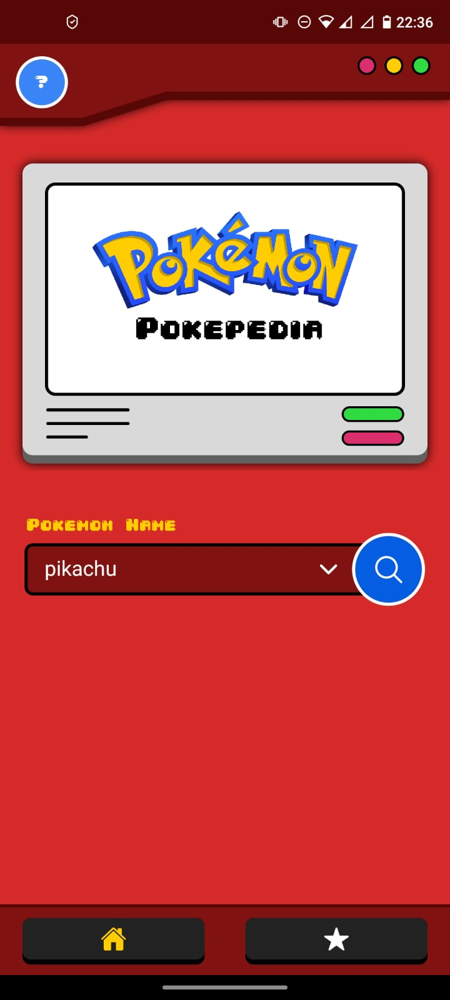
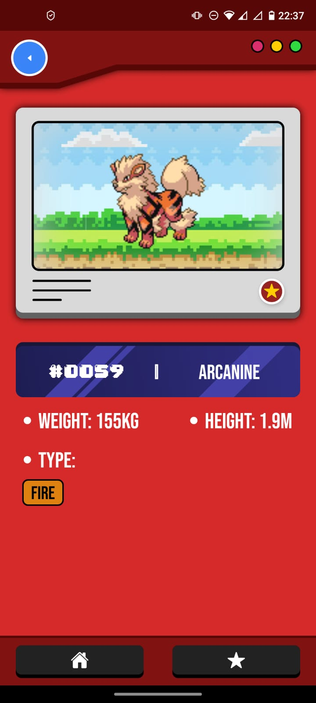
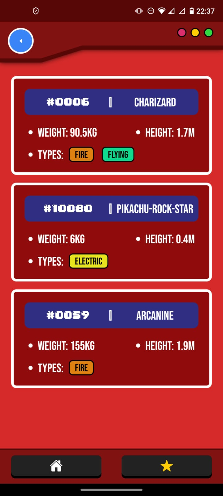
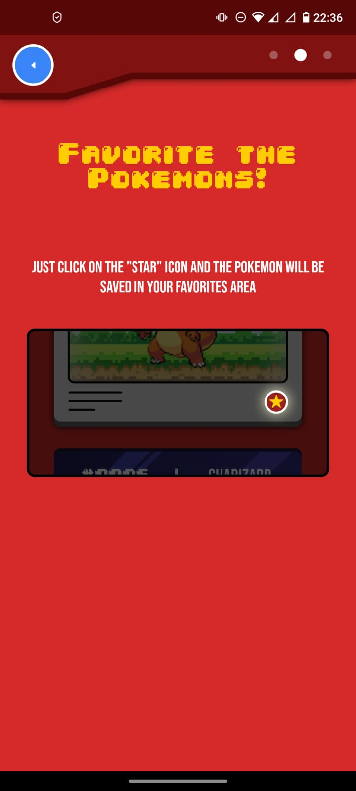

<div align="center">

# 🔴 Poképedia

### Sua Pokédex Digital no Bolso

Um aplicativo mobile desenvolvido em **React Native**, inspirado na famosa **Pokédex**, que permite explorar e consultar informações completas sobre todos os Pokémon!

[](https://reactnative.dev/)
[](https://developer.mozilla.org/pt-BR/docs/Web/JavaScript)
[](https://www.sqlite.org/)
[](https://pokeapi.co/)

[🌐 PokéAPI](https://pokeapi.co/)

</div>

---

## 📸 Capturas de Tela

<div align="center">
  <table>
    <tr>
      <td align="center">
        
        <br />
        <sub><b>🏠 Tela Inicial</b></sub>
      </td>
      <td align="center">
        
        <br />
        <sub><b>📊 Detalhes do Pokémon</b></sub>
      </td>
      <td align="center">
        
        <br />
        <sub><b>⭐ Pokémons Favoritos</b></sub>
      </td>
      <td align="center">
        
        <br />
        <sub><b>❓ Tela de Ajuda</b></sub>
      </td>
    </tr>
  </table>
</div>

---

## ✨ Funcionalidades

- 🔍 **Busca inteligente** - Encontre Pokémon rapidamente pelo nome ou número
- 📊 **Informações completas** - Visualize todos os dados importantes:
  - 🏷️ Nome e numeração na Pokédex
  - ⚖️ Peso e altura
  - 🎨 Tipos (Fogo, Água, Planta, Elétrico, etc.)
- ⭐ **Sistema de favoritos** - Salve seus Pokémon preferidos
- 📱 **Interface intuitiva** - Design simples e fácil de usar
- 🔄 **Dados atualizados** - Informações sincronizadas com a PokéAPI
- 💾 **Armazenamento local** - Acesso offline aos Pokémon favoritados

---

## 🛠️ Tecnologias

Este projeto foi desenvolvido com as seguintes tecnologias:

| Tecnologia | Descrição |
|------------|-----------|
| **React Native** | Framework multiplataforma para desenvolvimento mobile |
| **JavaScript** | Linguagem de programação principal |
| **API Sauce** | Cliente HTTP para consumo de APIs REST |
| **SQLite** | Banco de dados local para cache e favoritos |
| **React Navigation** | Sistema de navegação entre telas |
| **PokéAPI** | API pública com dados de todos os Pokémon |

---

## 🌐 Integração com PokéAPI

Este aplicativo utiliza a **[PokéAPI](https://pokeapi.co/)** como fonte de dados, uma API RESTful completa e gratuita que fornece:

- 📚 **+1000 Pokémon** de todas as gerações
- 🎮 **Informações de jogos** incluindo movimentos e habilidades
- 🗺️ **Dados de regiões** e localidades
- 🎨 **Sprites oficiais** em alta qualidade
- 🔄 **Atualizações constantes** com novos Pokémon

---

## 🚀 Como executar o projeto

### Pré-requisitos

Certifique-se de ter instalado em sua máquina:
- [Node.js](https://nodejs.org/) (v14 ou superior)
- [React Native CLI](https://reactnative.dev/docs/environment-setup)
- [Android Studio](https://developer.android.com/studio) (para Android)
- [Xcode](https://developer.apple.com/xcode/) (para iOS - apenas macOS)

### Instalação

```bash
# Clone este repositório
git clone https://github.com/daltonfrugoli/Pokedepedia.git

# Acesse a pasta do projeto
cd Pokedepedia

# Instale as dependências
npm install
# ou
yarn install

# Execute o aplicativo no Android
npx react-native run-android

# Execute o aplicativo no iOS (apenas macOS)
npx react-native run-ios
```

---

## 🎯 Roadmap

Funcionalidades planejadas para as próximas versões:

- [ ] 🌍 Suporte a múltiplos idiomas (PT, EN, ES, JP)
- [ ] 🎴 Visualização de evoluções em cadeia
- [ ] ⚔️ Simulador de batalhas entre Pokémon
- [ ] 📈 Gráficos comparativos de estatísticas
- [ ] 🎨 Temas personalizáveis (baseados em tipos de Pokémon)
- [ ] 🔔 Notificações sobre novos Pokémon adicionados
- [ ] 👥 Sistema de perfil de treinador
- [ ] 🏆 Conquistas e badges

---

## 🎮 Como usar

1. **Abra o app** e explore a lista de Pokémon disponíveis
2. **Busque** pelo nome ou número do Pokémon que deseja conhecer
3. **Toque** em um Pokémon para ver todos os detalhes
4. **Favorite** seus Pokémon preferidos tocando no ícone de estrela
5. **Acesse** a aba de favoritos para ver sua coleção pessoal

---

## 👤 Autor

**Dalton Frugoli**

- GitHub: [@daltonfrugoli](https://github.com/daltonfrugoli)
- LinkedIn: [Dalton Frugoli](http://www.linkedin.com/in/dalton-frugoli) <!-- Adicione seu link do LinkedIn aqui -->

---

## 🙏 Agradecimentos

- [PokéAPI](https://pokeapi.co/) - Pela incrível API gratuita
- [The Pokémon Company](https://www.pokemon.com/) - Pelos personagens icônicos
- Comunidade React Native - Pelo suporte e recursos

---

<div align="center">

⭐ **Gostou do projeto? Deixe uma estrela!** ⭐

🔴⚪ **Gotta code 'em all!** ⚪🔴

Feito com ❤️ e ☕ por [Dalton Frugoli](https://github.com/daltonfrugoli)

</div>
